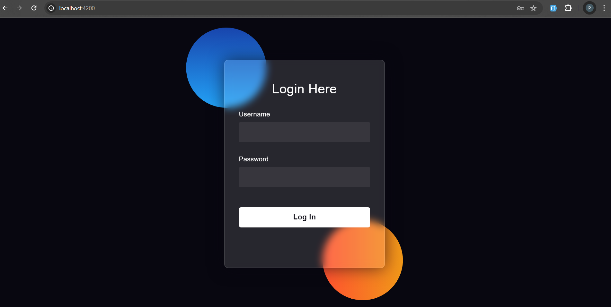
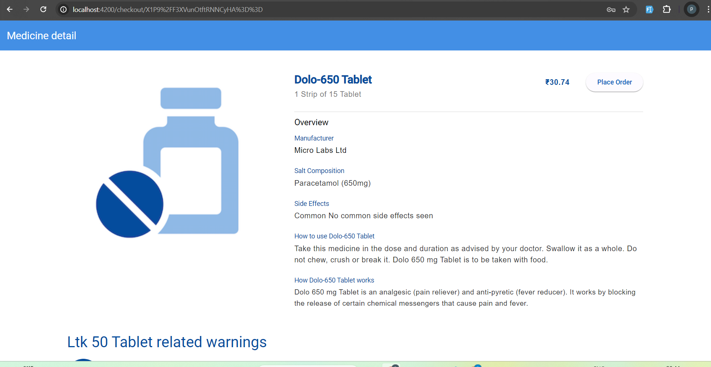
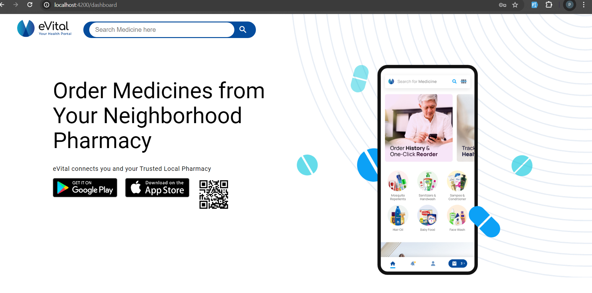
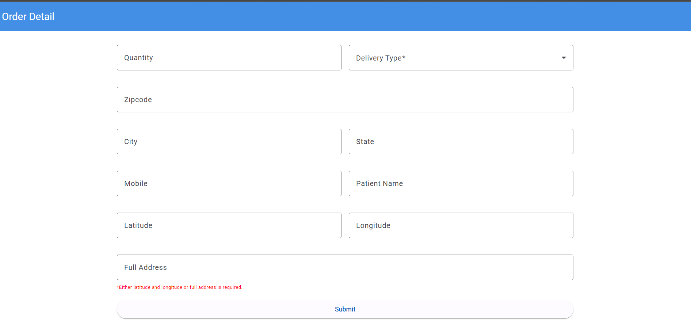
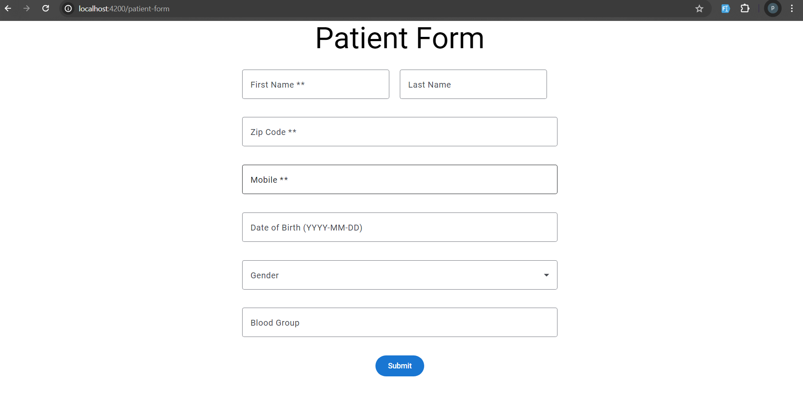

# EvitalAngular

This project was generated with [Angular CLI](https://github.com/angular/angular-cli) version 18.0.5.

## Development server

Run `ng serve` for a dev server. Navigate to `http://localhost:4200/`. The application will automatically reload if you change any of the source files.

Login to the Application:

Open the application in your web browser or interface.
Use the following credentials to log in:
Username: test@123
Password: 1234

Navigate to Add Patient:

After logging in, click on the "Add Patient" button.
This will take you to the dashboard.
Search for Medicine:

In the dashboard, find the search bar or section for medicines.
Enter the name of the medicine you are looking for and search.
View Medicine Details:

From the search results, select a medicine to view its details.
This will navigate you to the medicine detail page.
Place an Order:

On the medicine detail page, find the option to place an order.
Fill in the required details (e.g., quantity, delivery address, etc.).
Submit the order form.
Return to Dashboard:

After placing the order, use the navigation options or buttons provided to go back to the dashboard.

